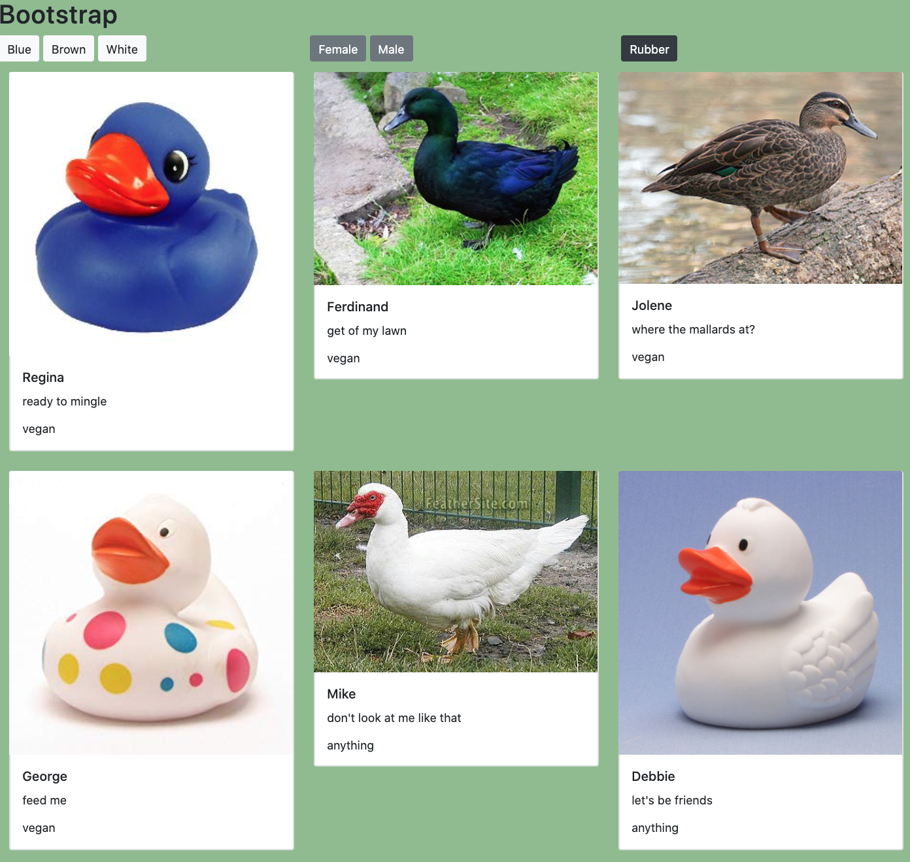

# Bootstrap

## Description
This project is an exploration into the bootstrap grid system.  We used bootstrap cards to display a collection of ducks (both real and rubber).  We also gave our users the ability to filter by color, gender, and if the ducks are rubber.

## Screenshots

## How to Run
1. Clone down this repo from gitHub
1. Make sure you have http-server installed via npm.  If not, get it [HERE](https://www.npmjs.com/package/http-server)
1. In your command line, run `hs -p 8999`
1. In your browser, go to `http://localhost:8999`
